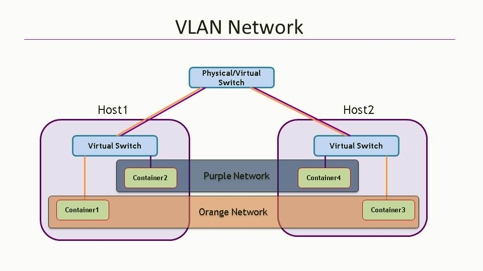

[](http://25b17de9.ngrok.com/view/Netplugin%20Sanity/job/Push%20Build%20Master/)

## Netplugin

Generic network plugin (experimental) is designed to handle networking use
cases in clustered multi-host systems. It is specifically designed to handle:

- Multi-tenant environment where disjoint networks are offered to containers on the same host
- SDN applications and interoperability with SDN solutions
- Interoperability with non container environment and hand-off to a physical network
- Instantiating policies/ACL/QoS associated with containers
- Multicast or multi-destination dependent applications
- Integration with existing IPAM tools for migrating customers
- Handle NIC's capabilities for acceleration (SRIOV/Offload/etc.)

The overall design is _not_ assumed to be complete, because of ongoing work in
the docker community with regards to the suitable APIs to interface with
network extensions like this. Regardless, flexibility in the design has been
taken into consideration to allow using a different state driver for key-value
synchronization, or a different flavor of a soft-switch i.e. linux-bridge, MAC
VLAN, or OpenvSwitch.

The ability to specify the intent succinctly is the primary goal of the design
and thus some of the specified user interface will change, and in some cases
functionality will be enhanced to accommodate the same. Design details and
future work is captured in a
[docs/design.md](https://github.com/contiv/netplugin/blob/master/docs/Design.md).

Please do not use this code in production, until code goes through more testing
and few critical open issues are resolved.

### Getting Started

This will provide you with a minimal experience of uploading the intent and
seeing the netplugin system act on it. It will create a network on your host
that lives behind an OVS bridge and has its own unique interfaces.

#### Step 1: Clone the project:

```
$ git clone https://github.com/contiv/netplugin
$ cd netplugin; make build demo ssh
```

#### Step 2: Inside the VM, boot `netmaster` and `netplugin`

```
$ cd /opt/golang/src/github.com/contiv/netplugin
$ sudo bin/netmaster &
$ sudo bin/netplugin -host-label host1 &
```

#### Step 3: Upload your intent, which we take from the `examples/` directory

```
$ netdcli -cfg examples/one_host_multiple_nets.json
```

**Note:** there are tons of examples of network intent in the `examples/`
directory. Try a few of them out!

#### Step 4: Run your containers and enjoy the networking!

```
$ docker run -itd --name=myContainer1 --hostname=myContainer1 ubuntu /bin/bash
$ docker run -itd --name=myContainer2 --hostname=myContainer2 ubuntu /bin/bash
$ docker exec -it myContainer1 /bin/bash
< inside the container >
$ ip addr
$ ping 11.1.0.2
```

#### Trying it out in a multi-host VLAN/VXLAN network

The [docs/TwoHostMultiVlanDemo.md](docs/TwoHostMultiVlanDemo.md) walks through
setting up a multi host demo network and deploy the following Vlan based
network: 

One can deploy the following Vxlan network by following the steps in the above
demo and using [examples/two_hosts_multiple_vxlan_nets.json](examples/two_hosts_multiple_vxlan_nets.json)
configuration file instead. Trying out the configuration is left as an exercise
to the reader.  

#### Multi-tenant network

In the examples directory [two_hosts_multiple_tenants.json](examples/two_hosts_multiple_tenants.json) and
[two_hosts_multiple_tenants_mix_vlan_vxlan.json](examples/two_hosts_multiple_tenants_mix_vlan_vxlan.json)
shows the creation of a multi-tenant (disjoint, overlapping) networks within a
cluster.

### Building and Testing

**Note:** Vagrant 1.7.4 and VirtualBox 5.0+ are required to build and test netplugin.

High level `make` targets:

* `demo`: start a VM (or multiple, set `CONTIV_NODES` to greater than 1) for
  development or testing.
* `build`: build the binary in a VM and download it to the host.
* `unit-test`: run the unit tests. Specify `CONTIV_NODE_OS=centos` to test on
  centos instead of ubuntu.
* `system-test`: run the networking/"sanity" tests. Specify
  `CONTIV_NODE_OS=centos` to test on centos instead of ubuntu.

#### Resource Allocation
Various network resources like, IP-Subnets, VLAN/VXLAN-IDs, IP Addresses, can
be automatically managed or they can be specified at network/endpoint
granularity. To avoid any conflict with rest of the network, it is encouraged
to specify the resource ranges, but when not specified, the resource-allocator
can pick up the default values.

#### Kubernetes Integration
The plugin code contains the netplugin code that interfaces with kublet to
allow network plumbing before a container is scheduled on one of the minions.
Please see [Kubernetes Integration](docs/kubernetes.md) for details

### How to Contribute
Patches and contributions are welcome, please hit the GitHub page to open an
issue or to submit patches send pull requests. Please sign your commits, and
read [CONTRIBUTING.md](docs/CONTRIBUTING.md)
